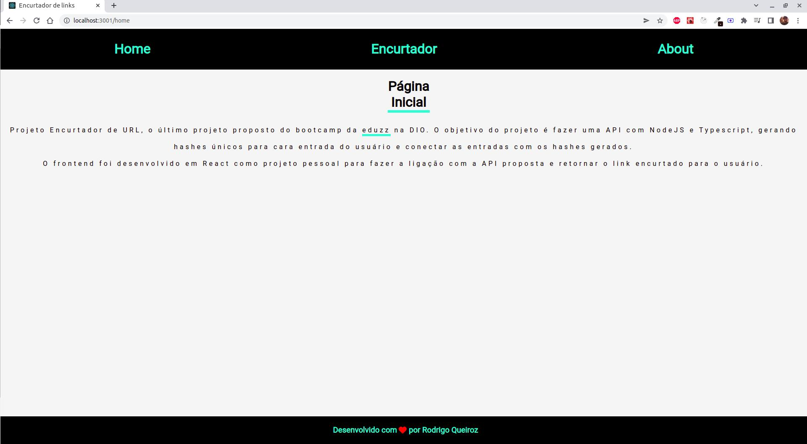
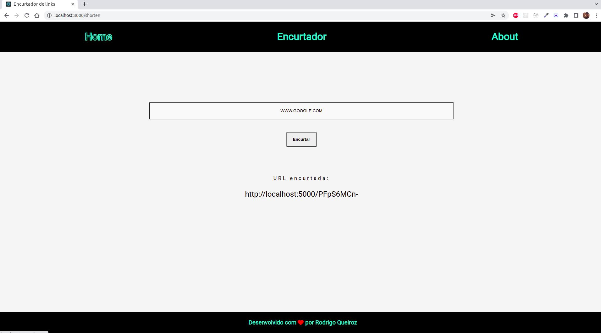
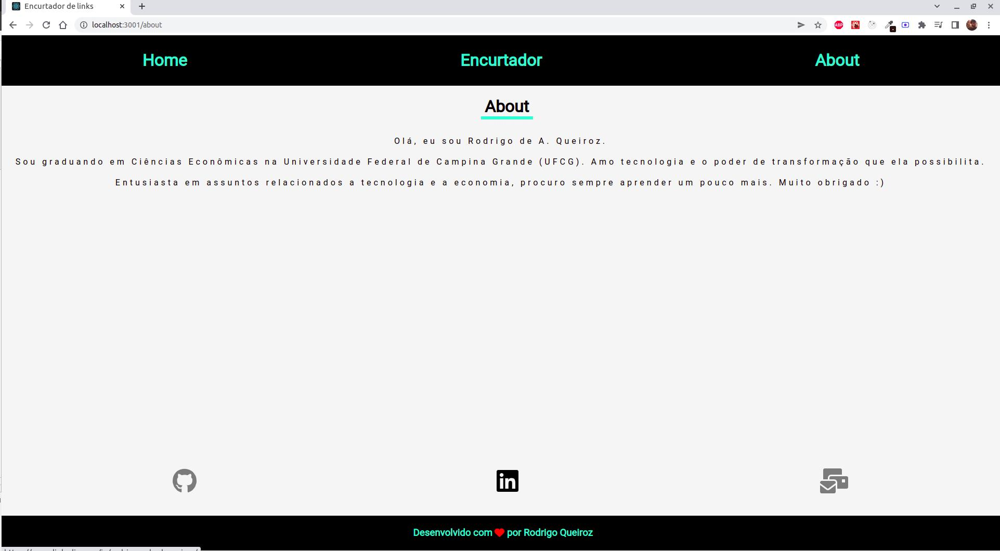

# Shortener URL - Frontend

#### Esse é o repositório do frontend do projeto, o back está [neste](https://github.com/rodrigoaqueiroz/url-shortener-backend) repositório.

--- 

# Habilidades

  - react;
  - axios;
  - ligação do back com o front;

--- 

# Instruções

 - Primeiro é necessário instalar as dependencias, na pasta raiz digite:
  '''npm install'''
 - Depois execute o script para rodar a API
 '''npm start'''

  Pronto, a API já está funcionando (rodando na porta 3000). 

---

### Frontend

O frontend consiste em um projeto simples utilizando React.

---

#### Comunicação com o backend

Na estrutura do projeto, há um arquivo `api.js`, onde são feitas as chamadas `HTTP` para a nossa API, utilizando o `axios`.

```javascript
{
  url: 'localhost:5000/shorten',
  originURL
}
```
---

#### Rotas

A aplicação consisteem três endpoints:
  - `/home` onde é apresentado o projeto 
  - `/shorten` é a rota onde o usuário digitará a URL que deseja ser encurtada;
  - `/about` que retorna informações sobre o autor.





---

# Contatos:

<div style="display: flex; align-items: center; justify-content: space-between;">
  <div>
    <h4> Rodrigo de A. Queiroz </h4>
  <div style="display: flex; align-items: center;">
      https://www.linkedin.com/in/rodrigoandradequeiroz/
  </div>
  <br/>
  <div style="display: flex;align-items: center;">
     https://github.com/rodrigoaqueiroz
  </div>
  <br/>
  <div style="display: flex;align-items: center;">
    </img>
    <a href="mailto:rodrigoandradequeiroz@gmail.com">rodrigoandradequeiroz@gmail.com</a>
  </div>
<br/>